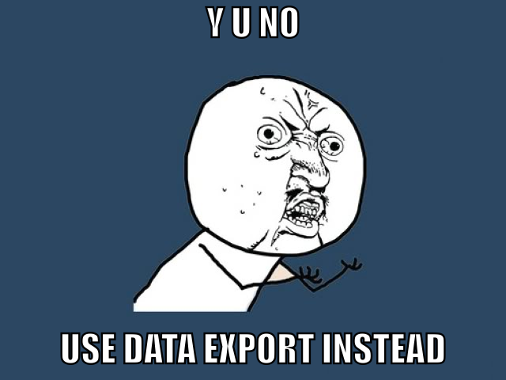

# [fit] Writing Code
# [fit] That Writes Code
# [fit] That Writes Code


^ Pearson Scott Foresman http://openclipart.org/detail/124111/tortoise-by-papapishu

---

# [fit] Gavin Stark

## [fit] Instructor: The Iron Yard Tampa Bay

---

# [fit] Not this Stark


---

# [fit] Not this Stark Either


---

# [fit] Why write code that writes code?

---

# [fit] $$1.$$ Metaprogramming

# [fit] $$2.$$ Data Transformation

# [fit] $$3.$$ For Pure Fun

---

# [fit] $$1.$$ Metaprogramming


---

# Rails

### ActiveRecord Attributes

### Association Methods

---

# Metaprogramming in Ruby

- `method_missing`
- `instance_eval`
- `define_method`

---

# [fit] Silly Metaprogramming


---

```Ruby
class String
  def method_missing(method_name, *args)
    if method_name =~ /\Ais_(.+)\?\Z/
      self == $1
    else
      super
    end
  end
end
 
"gavin".is_gavin?
"ironman".is_gavin?
"ironman".is_ironman?
```

---

# [fit] That all ya got?


---

```ruby
puts String.instance_methods.count
 
class String
  File.readlines("/usr/share/dict/words").each do |line|
    line.chomp!
    define_method("#{line}?") do
      self == line
    end
  end
end
 
string = "silly"
 
puts "Is it silly to have #{String.instance_methods.count} methods in String? => #{"silly".silly?}"
```

---

# [fit] $$2.$$ Data Transformation

---

# [fit] Major Data Migration

- 1:N Data
- Migrate Data
- Generate new data / structures

---

# Code -> Code

- Write code in the old system that outputs Ruby
- Run database migrations
- Run ruby script to modify/create data

---



---

# [fit] Y U NO?

- Transform code in two parts
- New system still under development, gives a chance to try API
- Can run parts of generated script in irb
- Code is standalone

---

# [fit] Shut up
# [fit] and convert my data


---

# Shut up and convert my data

- ActiveRecord use of models
- Iterate and use puts to output Ruby

---

```ruby
Player.all.each do |player|
  unless player.video_resolution
    puts %{# Player #{player.id} has no video_resolution}
    next
  end

  width, height = player.video_resolution.match(/(\d+)x(\d+).*/).captures

  puts %{
    display_configuration = DisplayConfiguration.where(
       screen_resolution_x: #{width}, screen_resolution_y: #{height},
       screen_array_x: 1, screen_array_y: 1, orientation: "LANDSCAPE").first

    raise "no display config" unless display_configuration
    Player.find(#{player.id}).
		  update_attributes(display_configuration_id: display_configuration.id)
  }
end
```

---

# [fit] Upgrade Process

- Run export script on old version
- Run all migrations (about 35)
- Run ruby script
- Profit

---

# [fit] $$3.$$ Just For Fun

---

# [fit] `Hacking time`

---

# [fit] New languages will *change your brain*

---

# [fit] Code for *fun*

---

# [fit] If you :heart: languages
# [fit] go watch this video

<br>

# [fit] bit.ly/kdGNxG

#### *... but not right now ...*

---

# [fit] Esoteric languages

---

# [fit] Whitespace

# [fit] Brainf*ck

# [fit] Shakespeare

# [fit] *Piet*

---

> Piet is a language ... whose programs are bitmaps that look like abstract art.
-- *you had me at hello*

---

# [fit] Piet Rules

- Direction pointer
- Codel chooser
- Stack based
- Integers only
- Commands (equal to variation in hue/lightness)

---


---

# [fit] *Unbeatable* Tic-Tac-Toe


---


---

# [fit] *Start with* Ruby

---

# [fit] Unbeatable Algorithm

### *(... hand wavy ...)*

- Recursively follow each possible move
- Assign positive points if I win
- Assign negative points if other player wins
- Assign zero points if a tie

---

# [fit] Unbeatable Algorithm

### *(... hand wavy ...)*

<br>

- At each level of recursion:
- Choose the *maximum* score possible for my moves
- Choose the *minimum* score possible for their moves

---


^ https://www.ocf.berkeley.edu/~yosenl/extras/alphabeta/alphabeta.html

---

## Make a database of every possible game board

---

# [fit] How To

- Automate Both Players
- Computer Plays Unbeatable Move
- Opponent Plays All Possible Moves
- Make a Database

---

# [fit] Output the database

- Export as `YAML` hash
- Key is the board state
- Value is the best move for the computer

---

```ruby
? !ruby/object:Board
  spaces:
  - O
  - .
  - .
  - .
  - .
  - .
  - .
  - .
  - .
: 4

```

---

# [fit] Run Ruby code to produce database

---

# [fit] Write some Piet code

## [fit] Use this database of moves

---

## I'd still be writing the
## Piet code if MS Paint
## was my editor

---

# Write code in a higher level language

---

## Piet Script
## *and*
## Piet Assembly

---

# [fit] Piet Script

- Like a *lame* version of `C`
- Methods
- `if` and `while`
- Variables
- Strings

---

# [fit] Piet Script

## [fit] *No* hashes, *no* data structures
## [fit] So how do we represent boards/decisions?

---

# [fit] Thinking in bases

<br>

## We all know
## base *`10`*
## and
## base *`2`*

---

# [fit] `X`, `O`, `blank`

---

# [fit] *Base 3*

---

# `"." -> 0`
# `"O" -> 1`
# `"X" -> 2`

---

```
O => 1
O => 1
. => 0
. => 0
X => 2
. => 0
. => 0
. => 0
. => 0
```

$$000020011_3$$

$$0\cdot3^8 + 0\cdot3^7 + 0\cdot3^6 + 0\cdot3^5 + 2\cdot3^4 + 0\cdot3^3 + 0\cdot3^2 + 1\cdot3^1 + 1\cdot3^0$$

*$$166$$*

---

# [fit] Turn the YAML file
# [fit] into hundreds of `if` statements

---

# [fit] Boards

<br>

- Represented as base `10` integers
- Decoded into base `3` for manipulation
- Printing
- Updating

---

# Print a board

---

```
print_board(board)
{
  print_piece((board/exponent(0))%3);
  print_piece((board/exponent(1))%3);
  print_piece((board/exponent(2))%3);
  asm { @"\r\n" }
  print_piece((board/exponent(3))%3);
  print_piece((board/exponent(4)%3));
  print_piece((board/exponent(5))%3);
  asm { @"\r\n" }
  print_piece((board/exponent(6))%3);
  print_piece((board/exponent(7))%3);
  print_piece((board/exponent(8))%3);
  asm { @"\r\n" }
}
```

---

```
print_piece(piece)
{
  if (piece == 0) { asm { @"." } }
  if (piece == 1) { asm { @"O" } }
  if (piece == 2) { asm { @"X" } }
}

exponent(position)
{
  exp = 1;
  for(i=0; i < position; i++)
  {
    exp = exp *3;
  }

  return exp;
}
```

---

# [fit] BRAINS

---

# [fit] Hundreds of `if` statements

---

```
get_computer_move_going_first(board)
{
  new_move = 0;
  if (board == 0)    { new_move =  0; }
  if (board == 5)    { new_move =  3; }
  if (board == 68)   { new_move =  4; }
  if (board == 473)  { new_move =  6; }
  if (board == 959)  { new_move =  5; }
  if (board == 2417) { new_move =  5; }
  if (board == 6791) { new_move =  5; }
  if (board == 140)  { new_move =  6; }
  if (board == 302)  { new_move =  4; }
  if (board == 1193) { new_move =  8; }
  if (board == 2651) { new_move =  2; }
  if (board == 3398) { new_move =  8; }
```

---

# [fit] Write Remainder of Code

- Prompts
- Input player move
- Determine computer move
- Mark board
- Detect win state
- Loop

---

# [fit] Go to my github for the code

---

# [fit] Piet Script -> *Compiler* -> Piet Assembly -> *Assembler* -> Image

---

# [fit] *Image* -> Piet Runner

---


---

# CODE

<br>

`https://github.com/gstark/tic-tac-toe/blob/master/piet/tic-tac-toe.png`

<br>

`https://github.com/gstark/tic-tac-toe`

---

# [fit] THANK YOU

<br>

## [fit] *Questions?*

---
