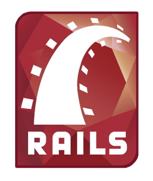
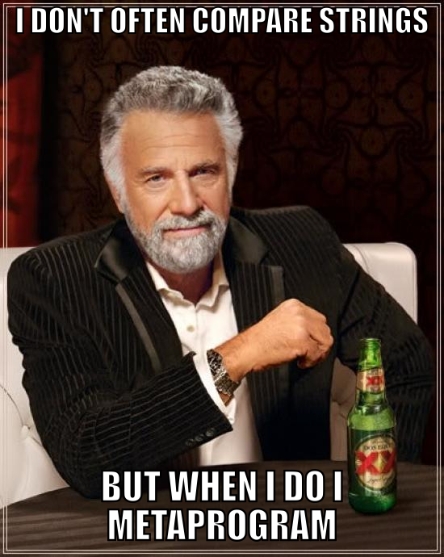
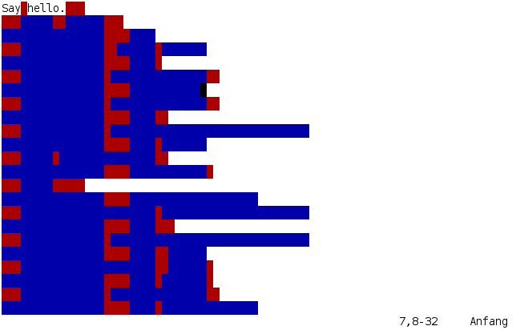
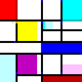
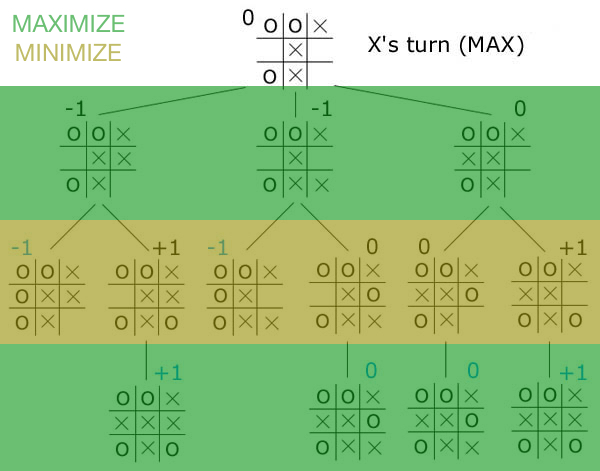
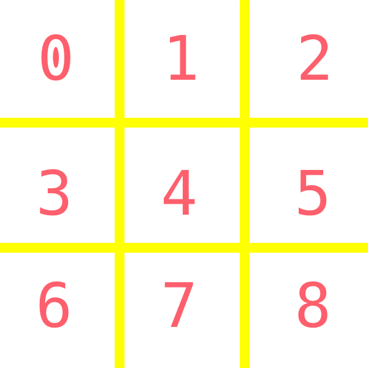
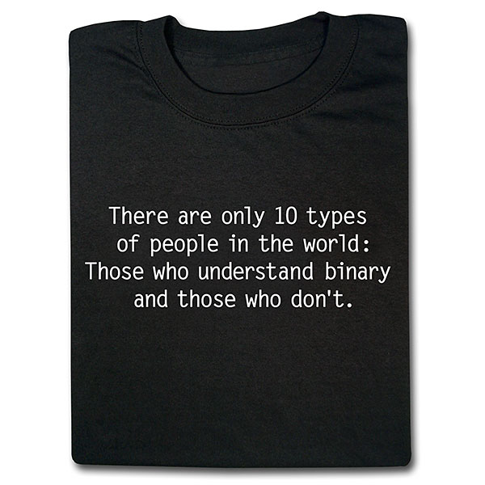

# [fit] Writing Code

<br>
# [fit] That Writes Code
<br>
# [fit] That Writes Code


^ Pearson Scott Foresman http://openclipart.org/detail/124111/tortoise-by-papapishu

---

# [fit] Gavin Stark

---

# [fit] Not this Stark


---

# [fit] Not this Stark either


---

# [fit] Why write code that writes code?

^ We write a lot of code
^ Tools make this experience better, faster, safer, and more enjoyable
^ Industry takes leaps forward when we improve tools
^ Rails

---

^ autoscale: true

# $$1.$$ Metaprogramming

# $$2.$$ Data Transformation

# $$3.$$ Optimizations

# $$4.$$ Just For Fun :smile:

---

# [fit] $$1.$$ Metaprogramming



---

# Rails

## ActiveRecord Attributes

## Association Methods

^ We get "methods" for all of our AR attributes and associations for "free"
^ Is this good, bad? Convention over configuration

---

# Metaprogramming in Ruby

- `method_missing`
- `instance_eval`
- `define_method`

---

# [fit] Silly Metaprogramming



---

```ruby
"gavin".is_gavin?  # => true
"ironman".is_gavin? # => false
"ironman".is_ironman? # => true
```

^ This is what I'd like
^ Maybe you've seen this before `Rails.env.development?`
^ [https://api.rubyonrails.org/classes/ActiveSupport/StringInquirer.html](StringInquirer)

---

`Ruby` :rocket: :mask:

```Ruby
class String
  def method_missing(method_name, *args)
    if method_name =~ /\Ais_(\w+)\?\Z/
      self == $1
    else
      super
    end
  end

  def respond_to_missing?(method_name, include_private = false)
    !!(method_name =~ /\Ais_(\w+)\?\Z/) || super
  end
end
 
"gavin".is_gavin?  # => true
"ironman".is_gavin? # => false
"ironman".is_ironman? # => true
```

---

# [fit] That all ya got?


---

```ruby
puts String.instance_methods.count
# => 183
```

---

```ruby
class String
  File.readlines("/usr/share/dict/words", chomp: true).each do |line|
    define_method("#{line}?") do
      self == line
    end
  end; nil # nil is just here to make it nicer to copy/paste to irb
end
```

---

```ruby
string = "silly"

puts "Is it silly to have
#{String.instance_methods.count}
methods in String? => #{"silly".silly?}"

# => Is it silly to have 236061 methods in String? => true
```

---

# [fit] $$2.$$ Data Transformation

---

# [fit] Major Data Migration

- New system was splitting data models
- Logical changes to how data was stored

---

# Code -> Code

1. Run code in the old system that outputs Ruby statements
2. Switch to new codebase
3. Run new system database migrations
4. Run Ruby script to modify/create data

---

# Y U NO?

<br>
- Transform code in two parts
- Can try out API while new system under development
- Can run parts of script in `irb`/`rails console` to validate
- Code is standalone

---

# Right Solution?

^ Not in all cases
^ Worked well in this case

---

# [fit] $$3.$$ Optimization

**MJIT**

> "Method Based Just-in-Time Compiler"

---

# [fit] Non-JIT Ruby

```

Ruby
└── YARV Instructions
    └── Ruby VM
        └── Execution

```

---

# [fit] :handwave: MJIT

```

Ruby
└── Intermedidiate Form
    └── C Code
        └── Compiler
            └── Object Files
                └── Execution

```

---

# [fit] Is this faster?

The answer, like many things, is **it depends**.

Mircobenchmarks: Sure
Big Monolithic Rails App: TBD

---

# [fit] But for today ...

---

# [fit] $$4.$$ Just For Fun

---

# [fit] `Hacking time`

---

# [fit] New languages will *change your brain*

^ New patterns
^ New approaches
^ New ways of thinking
^ Can bring those back and merge with current langauge style

---

# [fit] Code for _fun_

---

# [fit] If you :heart: languages

# [fit] go watch this video

<br>

# [fit] [https://vimeo.com/25958308](https://vimeo.com/25958308)

#### _... but not right now ..._

---

# [fit] Esoteric languages

---

# [fit] Whitespace

# [fit] Brain\*\*\*\*

# [fit] Shakespeare

# [fit] _Piet_

---

> Whitespace ignores any non-whitespace characters. Only spaces, tabs and linefeeds have meaning.

---



^ https://en.wikipedia.org/wiki/Whitespace_(programming_language)

---

> Brain\*\*\*\* - The language consists of only eight simple commands and an instruction pointer.

---

> While it is fully Turing-complete, it is not intended for practical use, but to challenge and amuse programmers.

---

<br>
<br>
<br>

```

++++++++[>++++[>++>+++>+++>+<<<<-]>
+>+>->>+[<]<-]>>.>---.+++++++..+++.

> > .<-.<.+++.------.--------.>>+.>++.

```

---


^ http://cdn-media-2.lifehack.org/wp-content/files/2014/09/tumblr_lp9tthzs0f1qz7hmlo1_400.gif

---

# Write an interpreter!

Good lanugage to learn to write interpreters!

---

# Shakespeare

> A programming language created with the design goal to make the source code resemble Shakespeare plays.

## [http://shakespearelang.sourceforge.net/report/shakespeare/#sec:hello](http://shakespearelang.sourceforge.net/report/shakespeare/#sec:hello)

---

# [fit] Piet

^ Named after Piet Mondrian

---

> Piet is a language ... whose programs are bitmaps that look like abstract art.
> -- _you had me at hello_

---



---

# [fit] Piet

- Direction pointer
- Codel chooser
- Stack based
- Integers only
- Character output via Unicode value
- Commands (equal to variation in hue/lightness)

---

# [fit] _Unbeatable_ Tic-Tac-Toe

---


^ Unbeatable Tic Tac Toe was the entrance coding challenge for a local software company.

^ While the company _mostly_ used Ruby, you could submit in any language you wanted.

^ **Challenge Accepted!**

---

# [fit] _Start with_ Ruby

---

# Unbeatable Algorithm

<br>

## Minimax

---

# [fit] Unbeatable Algorithm

### `:handwave:`

- Recursively follow each possible move
- Assign positive points if I win
- Assign negative points if other player wins
- Assign zero points if a tie

---

# [fit] Unbeatable Algorithm

### `:handwave:`

<br>

- At each level of recursion:
- Choose the _maximum_ score possible for my moves
- Choose the _minimum_ score possible for their moves

---



^ https://www.ocf.berkeley.edu/~yosenl/extras/alphabeta/alphabeta.html

---

## Make a database of every possible game board

^ Piet is a simple language
^ Encode as much of the logic as I can in data
^ Data types not very flexible, we'll come back to that

---

# [fit] Automate All The Things

- Automate both players
- Computer plays unbeatable move
- Opponent plays _ALL_ possible moves
- Recursively follow each possibility
- Make a $$database$$

---

# [fit] Algorithm


---

# [fit] Algorithm Model

Define a base Algorithm class

```ruby
class Algorithm
  attr_accessor :symbol

  def initialize(symbol)
    @symbol = symbol
  end

  def competitor_symbol
    @competitor_symbol ||= Board.other_player(symbol)
  end

  # Other code here...
end
```

---

# [fit] Subclasses Define `moves`

- Runner will ask each algorithm for an array of `moves` given a `board`

---

```ruby
class PlaysAllPossibleMoves < Algorithm
  def moves(board)
    board.empty_spaces
  end
end
```

---

```ruby
class UnbeatableTicTacToe < Algorithm
  def moves(board)
    score = min_max_score(board)

    Array(score.space)
  end
end
```

---

```ruby
class UnbeatableTicTacToe < Algorithm
  def min_max_score(board, is_me = true)
    current_symbol = is_me ? symbol : competitor_symbol

    board.empty_spaces.map { |space|
      # Generate a new board, but with a new move
      new_board = board.with_move(space, current_symbol)

      case
      when new_board.won_by?(current_symbol)
        # There is a winner, give the appropriate points
        Score.new(space, is_me ? 1 : -1)
      when new_board.full?
        # It is a tie, give 0 points
        Score.new(space, 0)
      else
        # Figure out the value by asking for the min_max
        # of the board we generated but flip which player
        # we are inquiring about
        Score.new(space, min_max_score(new_board, !is_me).value)
      end
    }.send(is_me ? :max_by : :min_by, &:value) || NO_SCORE
  end
end
```

---

# [fit] How Do You Test This?

---

# [fit] How Do You Test This?


<br>
<br>
<br>
<br>
<br>

# [fit] Pit the algorithms against each other

---

# [fit] How Do You Test This?

- Have the "plays all moves" player compete against the "unbeatable"
- :no_entry_sign: if the "plays all moves" ever :trophy:!
- Requires the game runner to:
  - Allow for pluggable algorithms
  - Have a callback after each move to check win state

---

# [fit] Output the database

- Test code should also generate a database (a hash)
  - `Key` is the board state
  - `Value` is the best move for the computer

---



```ruby
? !ruby/object:Board
  spaces:
  - O
  - .
  - .
  - .
  - .
  - .
  - .
  - .
  - .
: 4
```

---

# [fit] Write some Piet code

## [fit] Use this database of moves

---

## I'd still be writing the

## Piet code if Photoshop

## was my editor

---


[http://www.boredpanda.com/microsoft-paint-ebook-illustrations-camp-redblood-pat-hines/](http://www.boredpanda.com/microsoft-paint-ebook-illustrations-camp-redblood-pat-hines/)

---

# Write code in a higher level language

---

## Piet Script

## _and_

## Piet Assembly

---

# [fit] Piet Script

- Like a _worse_ version of `C`
- Methods
- `if` and `while`
- Variables
- Strings

---

# [fit] Piet Script

## [fit] _No_ hashes, _no_ data structures

## [fit] So how do we represent boards/decisions?

---

# [fit] Thinking in bases

<br>

## We know about

## base _`10`_

## and

## base _`2`_



^ http://www.thinkgeek.com/images/products/zoom/5aa9_binary_people_tee_fb.jpg

---

# But we have THREE options for each square

<br>

# [fit] `X`, `O`, `blank`

---

# [fit] _Base 3_

---

# `"." -> 0`

# `"O" -> 1`

# `"X" -> 2`

---

# Lets look at a sample board

```ruby
O => 1      # 1's position (low)
O => 1      # 3's position
. => 0      # 9's position
. => 0      # ...
X => 2      # ...
. => 0      # ...
. => 0      # ...
. => 0      # ...
. => 0      # 6561's position (high)
```

#### $$000020011_3$$

#### $$0\cdot3^8 + 0\cdot3^7 + 0\cdot3^6 + 0\cdot3^5 + 2\cdot3^4 + 0\cdot3^3 + 0\cdot3^2 + 1\cdot3^1 + 1\cdot3^0$$

_$$166$$_

---

# [fit] BTW

```ruby
"000020011".to_i(3) # => 166
```

---

# Boards

<br>

- Represented as base `10` integers
- Decoded into base `3` for manipulation
- Code to support printing and updating

---

# Print a board

---

# Conversions

Need a way to convert a base `10` number into components of a base 3

---

[.build-lists: true]

- How we do this in base 10?

- Example: `42578`

- To get the `8` we integer divide by 1 modulo `10`
- To get the `7` we integer divide by 10 (`4257`) and modulo `10`
- To get the `5` we integer divide by 100 (`425`) and modulo `10`
- To get the `2` we integer divide by 1000 (`42`) and modulo `10`
- To get the `4` we integer divide by 10000 (`4`) and modulo `10`

- > See the powers of `10` ?

---

# Except here we are raising to powers of `3` and module `3`

---

```
print_board(board)
{
  print_piece((board/exponent(0))%3);
  print_piece((board/exponent(1))%3);
  print_piece((board/exponent(2))%3);
  asm { @"\r\n" }
  print_piece((board/exponent(3))%3);
  print_piece((board/exponent(4))%3);
  print_piece((board/exponent(5))%3);
  asm { @"\r\n" }
  print_piece((board/exponent(6))%3);
  print_piece((board/exponent(7))%3);
  print_piece((board/exponent(8))%3);
  asm { @"\r\n" }
}
```

---

```
print_piece(piece)
{
  if (piece == 0) { asm { @"." } }
  if (piece == 1) { asm { @"O" } }
  if (piece == 2) { asm { @"X" } }
}

exponent(position)
{
  exp = 1;
  for(i=0; i < position; i++)
  {
    exp = exp * 3;
  }

  return exp;
}
```

---


# [fit] Braiiiins...

^ https://www.flickr.com/photos/bradmontgomery/7274622050/in/photolist-c5QkG7-d5C1NU-6P6hNd-6YudxV-a7CN5s-pJZbB-2BC4d2-cEc9qG-9RsSHC-6U95n7-pCbGTK-6Y8vGV-cYFx2y-xrnH-9UNwSB-6Am9xC-9ahCKG-xroR-9mwZ5m-oJprYn-6Y8vAk-aN2Mg-9UNwHp-6Ybrzd-FafCm-6Y9Kci-6YfVgb-6Y7oVD-6YbrKW-c5Qn3u-6Yye9h-9QeRNF-6Y9KdH-6YbrgU-6Y7oHk-6YbrkW-5B66fq-6Y7p6z-6YbrML-6Y7oCp-6Y9Kii-xrp2-gRsBdf-8QxvEb-6Y9K68-6Ybrv9-xroB-c5Qrus-JobGf-99xQvg

---

# [fit] Turn the database file

# [fit] into huge `if` statements

---

```
if ((board == 0)) { new_move = 0; }

if ((board == 5) || (board == 11) || (board == 1799) ||
    (board == 3743) || (board == 8117) || (board == 2615) ||
    (board == 8123) || (board == 8285) || (board == 10229)) { new_move = 3; }

if ((board == 68) || (board == 302) || (board == 788) ||
    (board == 2246) || (board == 6620) || (board == 794) || (board == 2252) ||
    (board == 7115) || (board == 7841) || (board == 9299) || (board == 44) ||
    (board == 266) || (board == 746) || (board == 2210) || (board == 8069)) { new_move = 4; }
```

# One of these statements for each possible new move (0..8)

---


# [fit] Write Remainder of Code

- Prompts
- Input player move
- Determine computer move
- Mark board
- Detect win state
- Loop

---

# [fit] Go to my [github](https://github.com/gstark/tic-tac-toe) for the code

---

# [fit] Piet Script -> _Compiler_ -> Piet Assembly -> _Assembler_ -> Image

---

# [fit] _Image_ -> Piet Runner

---


---

# DEMO

---

# CODE

<br>

[https://github.com/gstark/tic-tac-toe/blob/master/piet/tic-tac-toe.png](https://github.com/gstark/tic-tac-toe/blob/master/piet/tic-tac-toe.png)

<br>

[https://github.com/gstark/tic-tac-toe](https://github.com/gstark/tic-tac-toe)

---

# [fit] THANK YOU

<br>

## [fit] Questions:question:

---
