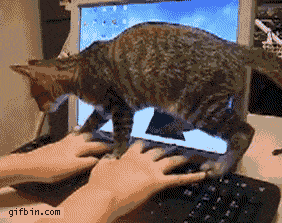

# [fit] Writing Code
<br>
# [fit] That Writes Code
<br>
# [fit] That Writes Code


^ Pearson Scott Foresman http://openclipart.org/detail/124111/tortoise-by-papapishu

---

# [fit] Gavin Stark

## [fit] Instructor: The Iron Yard Tampa Bay

---

# [fit] Not this Stark


---

# [fit] Not this Stark either


---

# [fit] Why write code that writes code?

---

# [fit] $$1.$$ Metaprogramming
<br>
# [fit] $$2.$$ Data Transformation
<br>
# [fit] $$3.$$ Just For Fun :smile:

---

# [fit] $$1.$$ Metaprogramming


---

# Rails

## ActiveRecord Attributes

## Association Methods

---

# Metaprogramming in Ruby

- `method_missing`
- `instance_eval`
- `define_method`

---

# [fit] Silly Metaprogramming


---

```Ruby
class String
  def method_missing(method_name, *args)
    if method_name =~ /\Ais_(.+)\?\Z/
      self == $1
    else
      super
    end
  end

  def respond_to_missing?(method_name, include_all = false)
    !!method_name =~ /\Ais_(.+)\?\Z/ || super
  end
end
 
"gavin".is_gavin?  # => true
"ironman".is_gavin? # => false
"ironman".is_ironman? # => true
```

---

# [fit] That all ya got?


---

```ruby
puts String.instance_methods.count
# => 174
 
class String
  File.readlines("/usr/share/dict/words", chomp: true).each do |line|
    define_method("#{line}?") do
      self == line
    end
  end; nil
end

string = "silly"

puts "Is it silly to have
     #{String.instance_methods.count}
     methods in String? => #{"silly".silly?}"
# => Is it silly to have 236052 methods in String? => true
```

---

# [fit] $$2.$$ Data Transformation

---

# [fit] Major Data Migration

- 1:N Data
- Migrate Data
- Generate new data / structures

---

# Code -> Code

- Write code in the old system that outputs Ruby
- Run database migrations
- Run Ruby script to modify/create data

---


---

# Y U NO?
<br>
- Transform code in two parts
- Can try out API while new system under development
- Can run parts of generated script in `irb`
- Code is standalone

---

# [fit] $$3.$$ Just For Fun

---

# [fit] `Hacking time`

---

# [fit] New languages will *change your brain*

---

# [fit] Code for *fun*

---

# [fit] If you :heart: languages
# [fit] go watch this video

<br>

# [fit] https://vimeo.com/25958308

#### *... but not right now ...*

---

# [fit] Esoteric languages

---

# [fit] Whitespace

# [fit] Brainf*ck

# [fit] Shakespeare

# [fit] *Piet*

---

> Whitespace ignores any non-whitespace characters. Only spaces, tabs and linefeeds have meaning.

---


^ https://en.wikipedia.org/wiki/Whitespace_(programming_language)

---

> Brainf*ck - The language consists of only eight simple commands and an instruction pointer.

---

> While it is fully Turing-complete, it is not intended for practical use, but to challenge and amuse programmers.

---

<br>
<br>
<br>

```
++++++++[>++++[>++>+++>+++>+<<<<-]>
+>+>->>+[<]<-]>>.>---.+++++++..+++.
>>.<-.<.+++.------.--------.>>+.>++.
```

---



^ http://cdn-media-2.lifehack.org/wp-content/files/2014/09/tumblr_lp9tthzs0f1qz7hmlo1_400.gif

---

# [fit] Piet

---

> Piet is a language ... whose programs are bitmaps that look like abstract art.
-- *you had me at hello*

---

# [fit] Piet

- Direction pointer
- Codel chooser
- Stack based
- Integers only
- Commands (equal to variation in hue/lightness)

---


---

# [fit] *Unbeatable* Tic-Tac-Toe


---


---

# [fit] *Start with* Ruby

---

# Unbeatable Algorithm

<br>

## Minimax

---

# [fit] Unbeatable Algorithm

### *(... hand wavy ...)*

- Recursively follow each possible move
- Assign positive points if I win
- Assign negative points if other player wins
- Assign zero points if a tie

---

# [fit] Unbeatable Algorithm

### *(... hand wavy ...)*

<br>

- At each level of recursion:
- Choose the *maximum* score possible for my moves
- Choose the *minimum* score possible for their moves

---


^ https://www.ocf.berkeley.edu/~yosenl/extras/alphabeta/alphabeta.html

---

## Make a database of every possible game board

---

# [fit] Automate All The Things

- Automate both players
- Computer plays unbeatable move
- Opponent plays *ALL* possible moves
- Recursively follow each possibility
- Make a $$database$$

---

# [fit] Algorithm


---

# [fit] Algorithm Model

Define a base Algorithm class

```ruby
class Algorithm
  attr_accessor :symbol

  def initialize(symbol)
    @symbol = symbol
  end

  def competitor_symbol
    @competitor_symbol ||= Board.other_player(symbol)
  end
end
```

---

# [fit] Subclasses Define `moves`

- Runner will ask each algorithm for an array of `moves` given a `board`

```ruby
class PlaysAllPossibleMoves < Algorithm
  def moves(board)
    board.empty_spaces
  end
end
```

---

# [fit] Minimax Algorithm

```ruby
class UnbeatableTicTacToe < Algorithm
  def moves(board)
    score = min_max_score(board, true)

    Array(score.space)
  end
  
  Score = Struct.new(:space, :value)
  NO_SCORE = Score.new(nil,nil)
end
```

---

```ruby
class UnbeatableTicTacToe < Algorithm
  def min_max_score(board, is_me)
    current_symbol = is_me ? symbol : competitor_symbol

    board.empty_spaces.map { |space|
      new_board = board.with_move(space, current_symbol)

      case
      # There is a winner, give the appropriate points
      when new_board.won_by?(current_symbol)
        Score.new(space, is_me ? 1 : -1)
      # It is a tie, give 0 points
      when new_board.full?
        Score.new(space, 0)
      # Figure out the value by asking for the min_max
      # of the board we generated but flip which player
      # we are inquiring about
      else
        Score.new(space, min_max_score(new_board, !is_me).value)
      end
    }.send(is_me ? :max_by : :min_by, &:value) || NO_SCORE
  end
end
```

---

# [fit] How Do You Test This?

---
# [fit] How Do You Test This?


<br>
<br>
<br>
<br>
<br>

# [fit] Pit two unbeatable algorithms against each other

---

# [fit] How Do You Test This?

- :no_entry_sign: if either of them :trophy:!
- Requires the game runner to:
 - Allow for pluggable algorithms
 - Have a callback after each move to check win state

---

# [fit] Output the database

- Test code should also generate a database!
- Key is the board state
- Value is the best move for the computer

---


```ruby
? !ruby/object:Board
  spaces:
  - O
  - .
  - .
  - .
  - .
  - .
  - .
  - .
  - .
: 4
```

---

# [fit] Write some Piet code

## [fit] Use this database of moves

---

## I'd still be writing the
## Piet code if MS Paint
## was my editor

---


http://www.boredpanda.com/microsoft-paint-ebook-illustrations-camp-redblood-pat-hines/

---

# Write code in a higher level language

---

## Piet Script
## *and*
## Piet Assembly

---

# [fit] Piet Script

- Like a *lame* version of `C`
- Methods
- `if` and `while`
- Variables
- Strings

---

# [fit] Piet Script

## [fit] *No* hashes, *no* data structures
## [fit] So how do we represent boards/decisions?

---

# [fit] Thinking in bases

<br>

## We all know
## base *`10`*
## and
## base *`2`*


^ http://www.thinkgeek.com/images/products/zoom/5aa9_binary_people_tee_fb.jpg

---

# But we have THREE options for each square

<br>

# [fit] `X`, `O`, `blank`

---

# [fit] *Base 3*

---

# `"." -> 0`
# `"O" -> 1`
# `"X" -> 2`

---

# Lets look at a sample board

```ruby
O => 1
O => 1
. => 0
. => 0
X => 2
. => 0
. => 0
. => 0
. => 0
```

#### $$000020011_3$$

#### $$0\cdot3^8 + 0\cdot3^7 + 0\cdot3^6 + 0\cdot3^5 + 2\cdot3^4 + 0\cdot3^3 + 0\cdot3^2 + 1\cdot3^1 + 1\cdot3^0$$

*$$166$$*

---

# [fit] BTW

```ruby
"000020011".to_i(3) # => 166
```

---

# Boards

<br>

- Represented as base `10` integers
- Decoded into base `3` for manipulation
- Code to support printing and updating

---

# Print a board

---

```
print_board(board)
{
  print_piece((board/exponent(0))%3);
  print_piece((board/exponent(1))%3);
  print_piece((board/exponent(2))%3);
  asm { @"\r\n" }
  print_piece((board/exponent(3))%3);
  print_piece((board/exponent(4)%3));
  print_piece((board/exponent(5))%3);
  asm { @"\r\n" }
  print_piece((board/exponent(6))%3);
  print_piece((board/exponent(7))%3);
  print_piece((board/exponent(8))%3);
  asm { @"\r\n" }
}
```

---

```
print_piece(piece)
{
  if (piece == 0) { asm { @"." } }
  if (piece == 1) { asm { @"O" } }
  if (piece == 2) { asm { @"X" } }
}

exponent(position)
{
  exp = 1;
  for(i=0; i < position; i++)
  {
    exp = exp * 3;
  }

  return exp;
}
```

---


# [fit] Braiiiins...

^ https://www.flickr.com/photos/bradmontgomery/7274622050/in/photolist-c5QkG7-d5C1NU-6P6hNd-6YudxV-a7CN5s-pJZbB-2BC4d2-cEc9qG-9RsSHC-6U95n7-pCbGTK-6Y8vGV-cYFx2y-xrnH-9UNwSB-6Am9xC-9ahCKG-xroR-9mwZ5m-oJprYn-6Y8vAk-aN2Mg-9UNwHp-6Ybrzd-FafCm-6Y9Kci-6YfVgb-6Y7oVD-6YbrKW-c5Qn3u-6Yye9h-9QeRNF-6Y9KdH-6YbrgU-6Y7oHk-6YbrkW-5B66fq-6Y7p6z-6YbrML-6Y7oCp-6Y9Kii-xrp2-gRsBdf-8QxvEb-6Y9K68-6Ybrv9-xroB-c5Qrus-JobGf-99xQvg

---

# [fit] Turn the database file
# [fit] into huge `if` statements

---

```
if ((board == 0)) { new_move = 0; }

if ((board == 5) || (board == 11) || (board == 1799) ||
    (board == 3743) || (board == 8117) || (board == 2615) ||
    (board == 8123) || (board == 8285) || (board == 10229)) { new_move = 3; }
  
if ((board == 68) || (board == 302) || (board == 788) ||
    (board == 2246) || (board == 6620) || (board == 794) || (board == 2252) ||
    (board == 7115) || (board == 7841) || (board == 9299) || (board == 44) ||
    (board == 266) || (board == 746) || (board == 2210) || (board == 8069)) { new_move = 4; }
```

# One of these statements for each possible new move (0..8)

---


# [fit] Write Remainder of Code

- Prompts
- Input player move
- Determine computer move
- Mark board
- Detect win state
- Loop

---

# [fit] Go to my [github](https://github.com/gstark/tic-tac-toe) for the code

---

# [fit] Piet Script -> *Compiler* -> Piet Assembly -> *Assembler* -> Image

---

# [fit] *Image* -> Piet Runner

---


---

# DEMO

---

# CODE

<br>

`https://github.com/gstark/tic-tac-toe/blob/master/piet/tic-tac-toe.png`

<br>

`https://github.com/gstark/tic-tac-toe`

---

# [fit] THANK YOU

<br>

## [fit] Questions:question:

---
